# CryptoDesk Terminal

**CryptoDesk Terminal** is a browser-based crypto intelligence workstation that turns live **SoSoValue** market data into ranked trading signals, **Grok** briefings, and **SoDEX** execution previews — on one screen.

Instead of acting like a generic news aggregator, CryptoDesk works as an **agentic intelligence layer**: ingest headlines and flows → analyze with lexicon + AI → surface signals → preview depth on SoDEX before any trade is placed.

> CryptoDesk helps solo researchers and retail traders run a one-person crypto desk without a Bloomberg terminal budget.

**Live demo:** [https://nanle-code.github.io/CryptoDesk/index.html](https://nanle-code.github.io/CryptoDesk/index.html)  
**Buildathon:** [SoSoValue Buildathon on AKINDO](https://app.akindo.io/wave-hacks/JBEQXgN4Zi2jA3wA) · Wave 2 — Intelligence Platform  
**Distinct name:** *CryptoDesk Terminal (Nanle)* — not affiliated with other “CryptoDesk” submissions.

---

## Table of Contents

- [Overview](#overview)
- [Problem](#problem)
- [Solution](#solution)
- [Core Features](#core-features)
- [How CryptoDesk Works](#how-cryptodesk-works)
- [System Architecture](#system-architecture)
- [User Flow](#user-flow)
- [Data Flow](#data-flow)
- [Signal Engine](#signal-engine)
- [Grok AI Layer](#grok-ai-layer)
- [SoSoValue Integration](#sosovalue-integration)
- [SoDEX Integration](#sodex-integration)
- [UI Surfaces](#ui-surfaces)
- [Client API Layer](#client-api-layer)
- [Storage](#storage)
- [Button Behavior](#button-behavior)
- [API Keys and Configuration](#api-keys-and-configuration)
- [Installation](#installation)
- [Running Locally](#running-locally)
- [Build and Deploy](#build-and-deploy)
- [Project Structure](#project-structure)
- [Safety Rules](#safety-rules)
- [Error Handling](#error-handling)
- [Roadmap](#roadmap)
- [Demo Flow for Judges](#demo-flow-for-judges)
- [Quality Checklist](#quality-checklist)
- [Disclaimer](#disclaimer)

---

## Overview

CryptoDesk is designed for:

- Solo crypto researchers
- Retail traders
- Signal-group operators
- On-chain analysts
- Hackathon judges verifying real API usage
- Anyone who wants **news + flows + signals + execution preview** in one tab

The product ingests a live SoSoValue feed, scores every headline, and routes high-conviction ideas toward SoDEX market depth.

Example workflow:

```text
1. Connect SoSoValue + Grok keys in Settings
2. Latest news loads from GET /news
3. Signal feed ranks headlines (bullish ETH · strength 4)
4. Open SoSoValue Hub → ETF flows, sectors, treasuries, macro
5. Click "Preview on SoDEX" → orderbook + trades on testnet
6. Generate Grok briefing from the same feed
```

---

## Problem

Crypto operators drown in fragmented tools:

- News lives in one app; ETF flows and sector data in another.
- Social signals lack structure (no strength, asset, or sentiment score).
- AI chatbots are disconnected from live market APIs.
- Execution venues are opened **before** reading orderbook depth.
- Many hackathon demos use **mock panels** that break under judge scrutiny.

Most products optimize for *finding* hype. CryptoDesk optimizes for **structured intelligence → signal → preview**.

---

## Solution

CryptoDesk creates a single terminal between **market intelligence** and **execution planning**.

It helps users answer:

- What is moving in crypto news right now?
- Which headlines carry tradeable conviction?
- What do ETF flows, sectors, and macro say today?
- What is corporate BTC treasury activity?
- Can this idea be sized against real SoDEX liquidity?
- What does Grok synthesize from the same SoSoValue feed?

---

## Core Features

### 1. Live News Feed (SoSoValue)

Three feed modes from the OpenAPI:

- `GET /news` — latest, filterable by category
- `GET /news/hot` — trending
- `GET /news/featured` — editorial picks

Categories: All · Breaking · Research · Institutional · KOL.

### 2. Lexicon Signal Engine

Every headline is scored locally (no extra API call):


| Output      | Description                               |
| ----------- | ----------------------------------------- |
| `sentiment` | `bullish` · `bearish` · `neutral`         |
| `strength`  | 1–5 (only ≥2 shown in Signal Feed)        |
| `asset`     | Ticker from `$SYMBOL` or matched currency |
| `reason`    | Human-readable cue count                  |


Optional **Grok enhancement** re-scores the top 3 signals.

### 3. SoSoValue Intelligence Hub

Center-tab dashboard — **8 parallel API calls** on load:

- Sector spotlight
- BTC + ETH ETF summary history (US)
- Macro events calendar
- SSI indices
- BTC corporate treasuries
- Fundraising projects
- ETF list

### 4. SoDEX Spot Terminal

Public testnet REST — **no API key required**:

- Symbol list · tickers · orderbook · recent trades
- Auto-refresh every 15 seconds
- Execution preview copy for Wave 3 (EIP-712 signed orders)

Default pair: `vBTC_vUSDC`.

### 5. Grok AI Briefings

With a Grok (xAI) key:

- **Daily briefing** from the top 20 headlines
- **Per-article analysis** on click
- **Signal enhancement** for top 3 opportunities

### 6. Agent Workflow Panel

Documents the full loop in the UI:

```text
SoSoValue INGEST → ANALYZE (Grok + lexicon) → SIGNAL → SoDEX PREVIEW → EXECUTE (Wave 3)
```

### 7. Intelligence Side Panel

Context panels with **API proof footers** (endpoint + UTC timestamp):

- Macro calendar · Sector spotlight · Dual ETF flows
- SSI indices (+ constituents when available)
- BTC treasuries · Fundraising radar
- SoDEX orderbook snapshot · Agent workflow

---

## How CryptoDesk Works

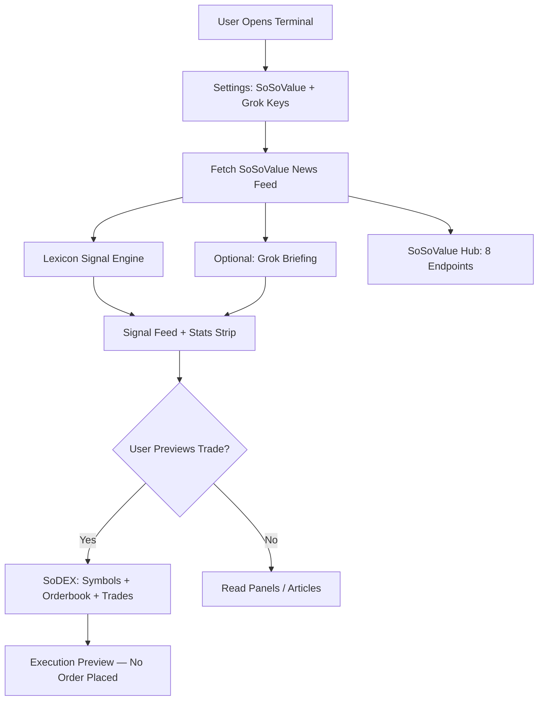


---

## System Architecture

CryptoDesk is a **client-side SPA** (React 19 + Vite 6). All API calls run in the browser; there is no custom backend server.

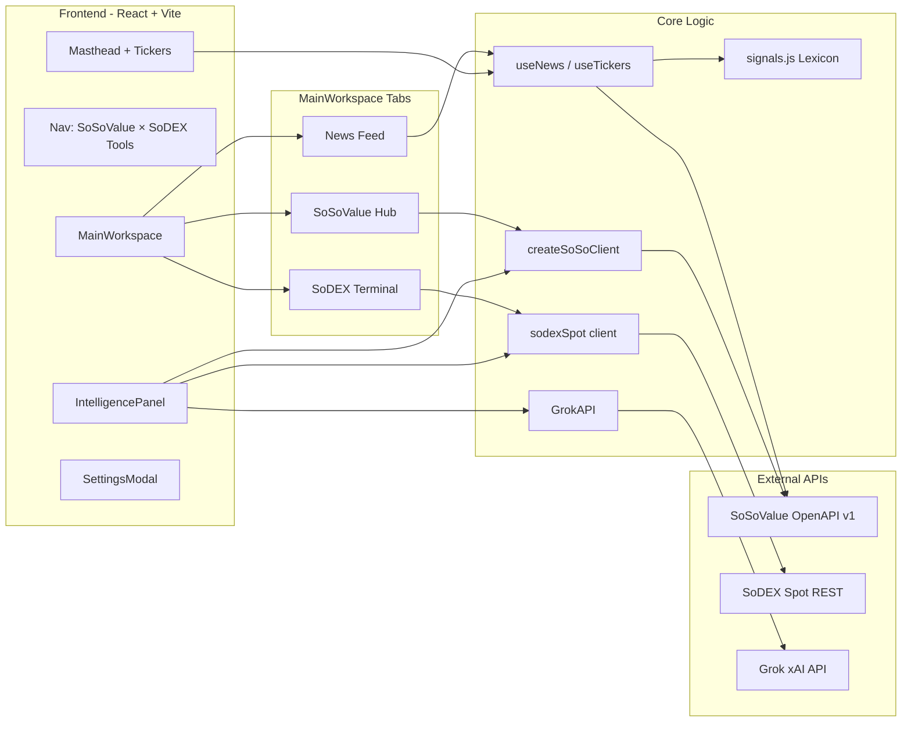


---

## User Flow

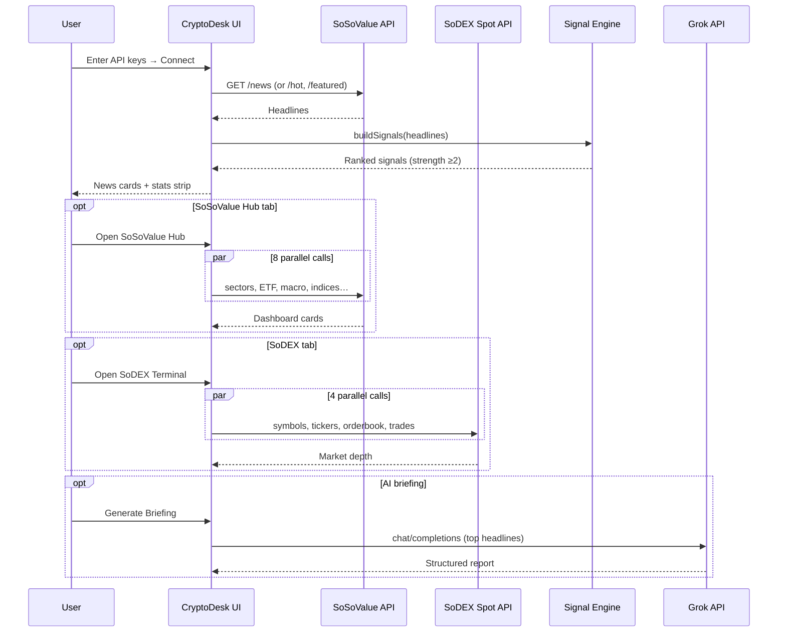


---

## Data Flow

```mermaid
flowchart TD
    A[SoSoValue API Key] --> B[useNews Hook]
    B --> C[/news · /news/hot · /news/featured]
    C --> D[News Cards]
    C --> E[buildSignals]
    E --> F[Signal Feed]
    E --> G[Sentiment % in Stats Strip]

    A --> H[createSoSoClient]
    H --> I[Hub + Intel Panels]
    I --> J[macro · sectors · ETF · indices · treasuries · fundraising]

    K[No key required] --> L[sodexSpot]
    L --> M[symbols · tickers · orderbook · trades]
    M --> N[SoDEX Terminal + Orderbook Panel]

    O[Grok API Key] --> P[GrokAPI]
    P --> Q[Briefing · Article Analysis · Signal Enhance]
    D --> P
```


---

## Signal Engine

The signal engine is **deterministic and local** — it runs on every headline without an LLM.

### Inputs

- Article `title` and `content` (HTML stripped)
- Optional `matched_currencies` from SoSoValue

### Lexicon


| Direction | Example cues                                                                         |
| --------- | ------------------------------------------------------------------------------------ |
| Bullish   | surge, rally, inflow, record, approval, adoption, launch, accumulation, etf, bullish |
| Bearish   | crash, dump, hack, exploit, ban, lawsuit, outflow, bearish, liquidation, sec         |


### Scoring rules

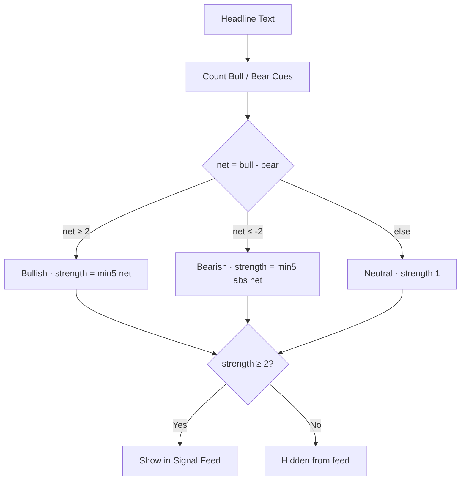


### Signal object

```js
{
  sentiment: 'bullish' | 'bearish' | 'neutral',
  strength: 1..5,
  asset: 'BTC' | 'ETH' | 'MARKET' | ...,
  title: string,
  reason: string,
  index: number  // news array index
}
```

---

## Grok AI Layer

Grok is **optional** and separate from SoSoValue / SoDEX.


| Feature          | Trigger              | Model                             |
| ---------------- | -------------------- | --------------------------------- |
| Daily briefing   | Masthead or nav      | `grok-2` via xAI chat completions |
| Article analysis | Article panel button | Same                              |
| Signal enhance   | Signal feed button   | Top 3 signals re-scored           |


Without a Grok key, lexicon signals and all SoSoValue / SoDEX data still work.

---

## SoSoValue Integration

**Base URL:** `https://openapi.sosovalue.com/openapi/v1`  
**Auth header:** `x-soso-api-key: <your-key>`

SoSoValue is the **primary intelligence layer** — news, macro, sectors, ETF flows, indices, treasuries, and fundraising.

### Endpoints used in the app


| Endpoint                               | UI location                     |
| -------------------------------------- | ------------------------------- |
| `GET /news`                            | News feed · Latest tab          |
| `GET /news/hot`                        | News feed · Hot tab             |
| `GET /news/featured`                   | News feed · Featured tab        |
| `GET /currencies`                      | Masthead ticker resolution      |
| `GET /currencies/{id}/market-snapshot` | BTC · ETH · SOL · BNB price bar |
| `GET /currencies/sector-spotlight`     | Hub card · Sector panel         |
| `GET /macro/events`                    | Hub card · Macro panel          |
| `GET /etfs/summary-history`            | Hub + ETF panel (BTC & ETH, US) |
| `GET /etfs`                            | Hub · ETF list card             |
| `GET /indices`                         | Hub · Indices panel             |
| `GET /indices/{ticker}/constituents`   | Indices panel (first index)     |
| `GET /btc-treasuries`                  | Hub · Treasuries panel          |
| `GET /fundraising/projects`            | Hub · Fundraising panel         |


### Additional client methods (ready in `sosovalue.js`)

Available in the client for future UI — not all wired to panels yet:

- `GET /currencies/{id}/klines`
- `GET /etfs/{ticker}/market-snapshot`
- `GET /indices/{ticker}/market-snapshot`
- `GET /indices/{ticker}/klines`
- `GET /btc-treasuries/{ticker}/purchase-history`
- `GET /analyses` · `GET /analyses/{name}`

### SoSoValue data flow

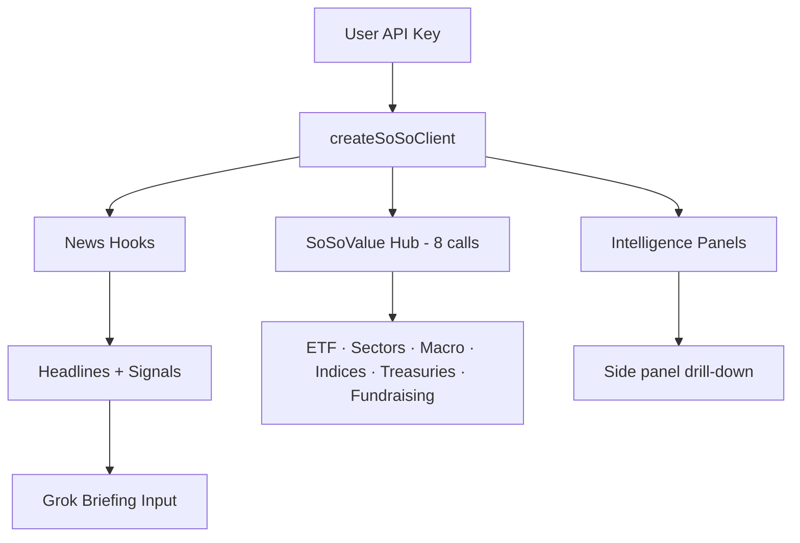


### Demo mode (no key)

If no SoSoValue key is set, the feed loads `**mockNews()**` — clearly labeled via toast: *“Demo mode — connect SoSoValue API in settings.”*  
Intel panels show `Connect SoSoValue API key in Settings` instead of faking live macro/ETF data.

---

## SoDEX Integration

**Testnet base:** `https://testnet-gw.sodex.dev/api/v1/spot`  
**Mainnet base:** `https://mainnet-gw.sodex.dev/api/v1/spot` (client supports; UI defaults to testnet)

SoDEX is the **execution and microstructure layer** — public reads need **no API key**.

### Endpoints used in Wave 2


| Endpoint                          | Purpose       |
| --------------------------------- | ------------- |
| `GET /markets/symbols`            | Symbol picker |
| `GET /markets/tickers`            | Ticker strip  |
| `GET /markets/{symbol}/orderbook` | Bid/ask depth |
| `GET /markets/{symbol}/trades`    | Recent prints |


### Client also exposes (not all in UI yet)

`coins`, `miniTickers`, `bookTickers`, `klines` — see `src/api/sodex.js`.

### SoDEX data flow

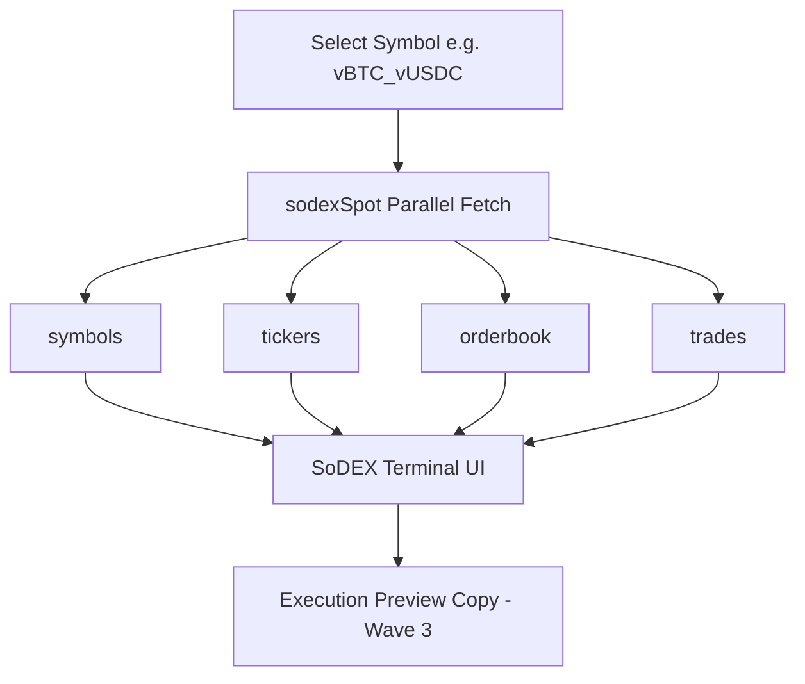


### SoDEX usage levels

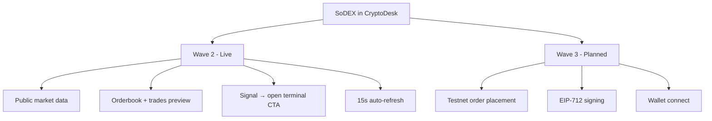


**Note:** `cd_sodex` in session storage is reserved for future authenticated actions. Public market data works without it.

---

## UI Surfaces

CryptoDesk uses a **three-column layout**: Nav · Main workspace · Intelligence panel.

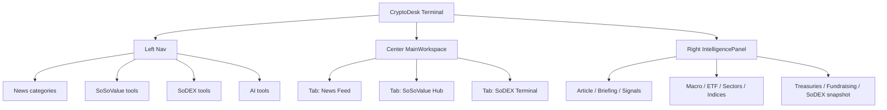


### Center tabs


| Tab            | Route (in-app)   | Data source               |
| -------------- | ---------------- | ------------------------- |
| News feed      | `mainTab: news`  | SoSoValue `/news*`        |
| SoSoValue Hub  | `mainTab: soso`  | 8× SoSoValue endpoints    |
| SoDEX Terminal | `mainTab: sodex` | 4× SoDEX public endpoints |


### Masthead

- Live tickers (BTC, ETH, SOL, BNB) via currencies + market-snapshot
- **Generate Briefing** → Grok

### Trust bar

Articles count · Signals count · Bullish sentiment % · SoSoValue / SoDEX / Grok badges

---

## Client API Layer

There is **no Next.js `/api` backend**. All integration is in the browser:


| Module           | File                      | Role                                  |
| ---------------- | ------------------------- | ------------------------------------- |
| SoSoValue fetch  | `src/lib/api.js`          | `sosoFetch`, `unwrapData`, `apiProof` |
| SoSoValue client | `src/api/sosovalue.js`    | `createSoSoClient()`                  |
| SoDEX client     | `src/api/sodex.js`        | `sodexSpot.`*                         |
| Grok client      | `src/api/grok.js`         | `GrokAPI` class                       |
| News hook        | `src/hooks/useNews.js`    | Feed + signals + auto-refresh 60s     |
| Tickers hook     | `src/hooks/useTickers.js` | Masthead prices                       |


---

## Storage

CryptoDesk stores **only configuration** in the browser — no server database.

### Session storage keys

```text
cd_soso   → SoSoValue API key
cd_grok   → Grok (xAI) API key
cd_sodex  → Reserved for future SoDEX signing
cd_topic  → Optional briefing focus topic
cd_dark   → Theme preference
```

Keys are kept in `**sessionStorage**` (cleared when the tab closes). They are **never** written to the repository or committed to git.

### What is not stored

- No fake saved reports
- No seeded watchlist
- No hardcoded dashboard history
- No persistent signal archive (Wave 3 candidate)

---

## Button Behavior

Every primary control maps to a real action:

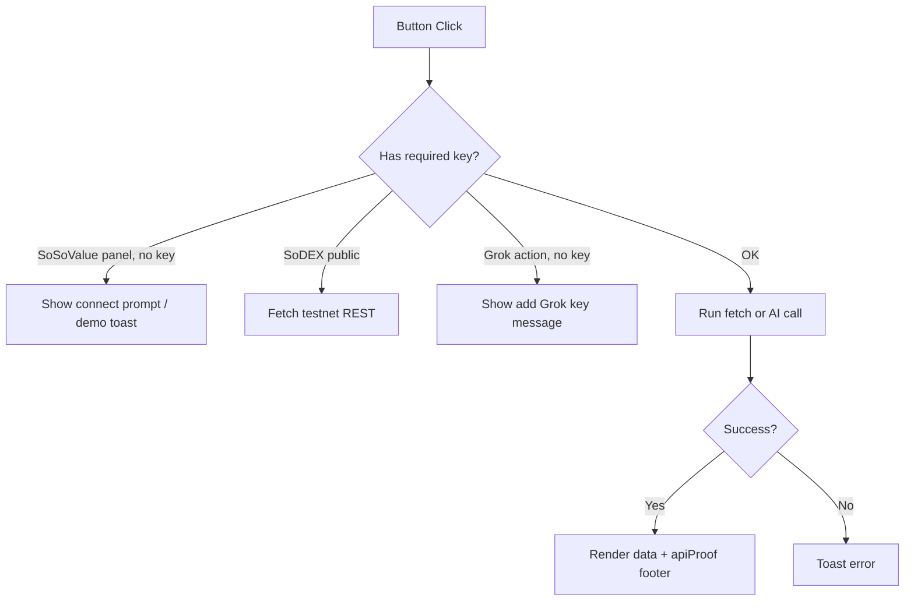


| Button                     | Behavior                                  |
| -------------------------- | ----------------------------------------- |
| ⚙ Settings                 | Open modal for API keys                   |
| Connect                    | Save keys to sessionStorage · reload feed |
| Latest / Hot / Featured    | Switch SoSoValue news endpoint            |
| News category (nav)        | Filter `GET /news?category=`              |
| SoSo hub (nav)             | `mainTab → soso`                          |
| SoDEX terminal (nav)       | `mainTab → sodex`                         |
| ETF / Macro / Sectors / …  | Load panel in Intelligence column         |
| ✦ Generate Briefing        | Grok briefing from current feed           |
| ✦ Analyze with Grok        | Per-article Grok analysis                 |
| ✦ AI-enhance top 3 signals | Grok `scoreSignal` on top 3               |
| ◎ Preview on SoDEX         | Jump to SoDEX tab + default symbol        |
| Open SoDEX terminal →      | From orderbook panel                      |
| Signal card click          | Open linked article in intel panel        |


---

## API Keys and Configuration


| Key            | Required for                          | Where to get                                        |
| -------------- | ------------------------------------- | --------------------------------------------------- |
| **SoSoValue**  | Live news, hub, intel panels          | [SoSoValue](https://sosovalue.com) developer portal |
| **Grok (xAI)** | Briefings, analysis, signal enhance   | [x.ai](https://x.ai)                                |
| **SoDEX**      | *Not required* for Wave 2 market data | Public REST on testnet                              |


### Settings flow

1. Open **Settings** (masthead).
2. Paste SoSoValue key (required for live data panels).
3. Paste Grok key (optional).
4. Click **Connect** → toast *“Connected — loading live data…”*

---

## Installation

```bash
git clone https://github.com/Nanle-code/CryptoDesk.git
cd CryptoDesk   # or cryptodesk-project/cryptodesk
npm install
```

---

## Running Locally

```bash
npm run dev
```

Open:

```text
http://localhost:5173/CryptoDesk/
```

(Vite `base` is `/CryptoDesk/` for GitHub Pages.)

---

## Build and Deploy

```bash
npm run build    # output → dist/
npm run preview  # local preview of production build
```

### GitHub Pages

The repo uses `.github/workflows/deploy.yml` to build `cryptodesk/` and publish `dist/` to GitHub Pages.

**Live URL:** [https://nanle-code.github.io/CryptoDesk/index.html](https://nanle-code.github.io/CryptoDesk/index.html)

### Other hosts

Deploy the contents of `dist/` to any static host (Netlify, Vercel, S3, etc.). Set the site base path to `/CryptoDesk/` or adjust `vite.config.js` `base`.

---

## Project Structure

```text
cryptodesk/
├── index.html                 # Vite entry
├── package.json
├── vite.config.js             # base: /CryptoDesk/
├── README.md
├── docs/
│   ├── WAVE2_SUBMISSION.md    # AKINDO copy-paste text
│   └── ROADMAP.md
├── legacy/                    # Wave 1 vanilla HTML (archived)
├── src/
│   ├── App.jsx                # Shell: Nav + MainWorkspace + Intel
│   ├── main.jsx
│   ├── api/
│   │   ├── sosovalue.js       # createSoSoClient — full OpenAPI surface
│   │   ├── sodex.js           # sodexSpot public REST
│   │   └── grok.js            # GrokAPI briefings + analysis
│   ├── components/
│   │   ├── MainWorkspace.jsx  # Tabs: News | SoSo Hub | SoDEX
│   │   ├── SoSoDashboard.jsx  # 8 parallel SoSoValue calls
│   │   ├── SoDEXTerminal.jsx  # Orderbook + trades terminal
│   │   ├── NewsFeed.jsx
│   │   ├── Nav.jsx            # SoSoValue × SoDEX navigation
│   │   ├── IntelligencePanel.jsx
│   │   ├── Masthead.jsx
│   │   ├── TrustBar.jsx
│   │   ├── SignalList.jsx
│   │   ├── SettingsModal.jsx
│   │   └── …
│   ├── context/
│   │   └── ConfigContext.jsx  # sessionStorage keys
│   ├── hooks/
│   │   ├── useNews.js
│   │   └── useTickers.js
│   ├── lib/
│   │   ├── api.js             # sosoFetch, apiProof
│   │   ├── signals.js         # Lexicon engine
│   │   ├── format.js
│   │   └── mockNews.js        # Demo mode only
│   └── styles/
│       └── app.css            # Dark cyber-fintech design system
└── dist/                      # Production build (generated)
```

---

## Safety Rules

CryptoDesk follows these rules for hackathon integrity:

1. **No mock data when live panels claim to be live** — macro, ETF, sectors, treasuries require a SoSoValue key.
2. **Demo mode is explicit** — toast + `mockNews()` only for the news feed without a key.
3. **API proof on panels** — endpoint string + UTC time on data blocks.
4. **No silent fallback** — failed API calls show errors, not fake numbers.
5. **No wallet required** for Wave 2.
6. **No order execution** on SoDEX in Wave 2 — preview only.
7. **No auto-trading.**
8. **Keys stay in sessionStorage** — never committed to the repo.
9. **Grok is labeled** — AI briefings are clearly Grok-generated, not SoSoValue.
10. **Honest submission copy** — see `docs/WAVE2_SUBMISSION.md`.

---

## Error Handling

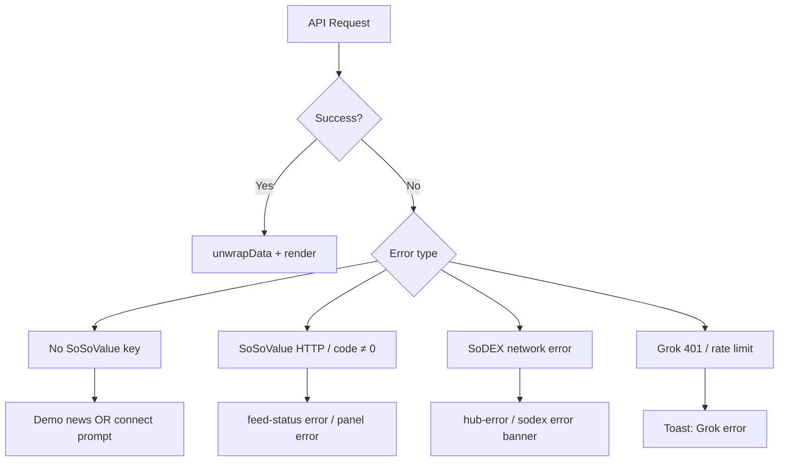


---

## Roadmap

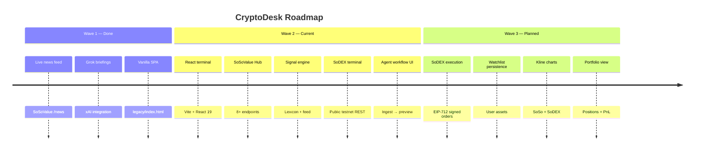


---

## Demo Flow for Judges

Prove this journey in ~90 seconds with **DevTools → Network** open:

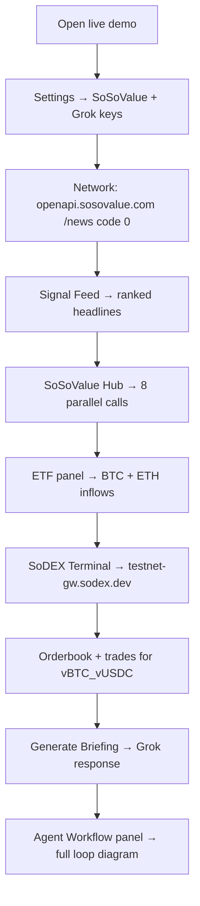


### What to verify

1. `openapi.sosovalue.com` responses return `code: 0`
2. ETF / macro / sector panels match API JSON (not static HTML)
3. `testnet-gw.sodex.dev` calls succeed without a SoDEX key
4. Stats strip updates article + signal counts when news loads
5. Submission text in `docs/WAVE2_SUBMISSION.md` matches the demo

---

## Quality Checklist


- React + Vite terminal
- SoSoValue news (`/news`, `/hot`, `/featured`)
- SoSoValue hub (8 parallel endpoints)
- Live tickers (currencies + market-snapshot)
- Intel panels (macro, sectors, ETF, indices, treasuries, fundraising)
- Lexicon signal engine + Signal Feed
- Grok briefing + article analysis + signal enhance
- SoDEX testnet terminal (symbols, tickers, orderbook, trades)
- Agent workflow panel
- API proof footers
- `npm run build` passes
- Final demo video with Network tab visible

### Engineering checklist

- All nav tools load correct panel or tab
- No mock data in SoSoValue panels when key is connected
- Demo mode only affects news feed without key
- SoDEX works without SoDEX key
- Signal → SoDEX CTA opens terminal tab
- Mobile layout acceptable
- README matches live behavior

---

## Disclaimer

CryptoDesk Terminal is a **market intelligence and decision-support tool** for research and education.

It does **not** provide financial advice. Signals, briefings, and AI outputs are informational. Users are responsible for their own trading decisions. SoDEX execution preview does not place orders in Wave 2.

---

## One-Line Summary

**CryptoDesk Terminal is a SoSoValue-powered intelligence workstation that scores live news into signals, explains markets with Grok AI, and previews SoDEX orderbook depth before execution — built for the SoSoValue Buildathon Wave 2.**

---

*Powered by [SoSoValue](https://sosovalue.com) · [SoDEX](https://sodex.com) · [Grok / xAI*](https://x.ai)