# CryptoDesk

**CryptoDesk** is an AI-powered on-chain intelligence terminal that turns raw crypto market data into actionable trading decisions.

Instead of acting like a standard news aggregator or signal bot, CryptoDesk works as a **full data-to-decision pipeline**. It fetches real market data from SoSoValue, classifies signals with Grok AI, generates ranked opportunities with explainability, runs multi-agent investment committee reviews, and previews execution on SoDEX — all in one browser tab, no backend required.

> CryptoDesk gives solo researchers and retail traders a Bloomberg-grade intelligence loop without the Bloomberg budget.

---

## Table of Contents

- [Overview](#overview)
- [Problem](#problem)
- [Solution](#solution)
- [Core Features](#core-features)
- [How CryptoDesk Works](#how-cryptodesk-works)
- [System Architecture](#system-architecture)
- [User Flow](#user-flow)
- [Data Flow](#data-flow)
- [AI Agent Layer](#ai-agent-layer)
- [SoSoValue Integration](#sosovalue-integration)
- [SoDEX Integration](#sodex-integration)
- [Signal Classification Engine](#signal-classification-engine)
- [Panels](#panels)
- [Storage](#storage)
- [Button Behavior](#button-behavior)
- [Environment Variables](#environment-variables)
- [Installation](#installation)
- [Running Locally](#running-locally)
- [Project Structure](#project-structure)
- [Safety Rules](#safety-rules)
- [Business Model](#business-model)
- [Roadmap](#roadmap)
- [Disclaimer](#disclaimer)

## Core Logic Flow

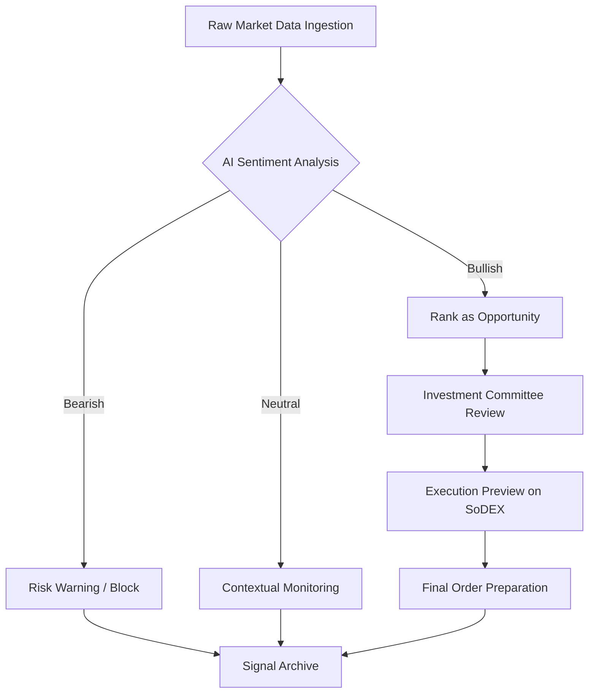

---

## Overview

CryptoDesk is designed for:

- Solo crypto researchers
- Retail traders
- DeFi users
- Signal groups
- Market analysts
- Portfolio managers
- DAO contributors
- Trading communities

The product provides a complete intelligence terminal experience:

```text
Connect SoSoValue API + Grok API
↓
Live news feed → AI signal classification → Ranked opportunities
↓
Investment committee review → Strategy playbook → SoDEX execution preview
```

CryptoDesk delivers:

```text
5 live articles → 2 AI signals → 40% bullish sentiment
Top Opportunity: ETH — Buy — 78% confidence
Committee: Analyst  Risk  Macro  Execution 
Strategy: Ethereum ETF Momentum — 14 days — Medium risk
Execution: Preview on SoDEX testnet — 0.12% slippage
```

---

## Problem

Crypto users make trading decisions with fragmented tools and incomplete data.

Common problems include:

- News, signals, and execution are spread across different platforms.
- Traders act on hype without understanding risk context.
- Signal bots provide recommendations with no explainability.
- No connection exists between market intelligence and trade execution.
- Retail traders cannot access institutional-grade analysis workflows.
- Portfolio construction is disconnected from real-time market data.
- Market narrative shifts are invisible until it is too late.

Most crypto tools solve one piece of the puzzle.

CryptoDesk connects every piece — from data ingestion to execution preview.

---

## Solution

CryptoDesk creates a unified intelligence terminal that handles the entire trading decision workflow.

It helps users answer:

- What is happening in the market right now?
- Which news items are actionable signals?
- What opportunities exist and why?
- What do multiple AI agents think about this trade?
- What is the optimal portfolio allocation?
- Which narratives are rotating?
- What does the execution look like on SoDEX?
- What is my signal history and audit trail?

---

## Core Features

### 1. Real-Time News Feed

CryptoDesk pulls live crypto news from SoSoValue's OpenAPI.

Sources:

- Latest news (`/news`)
- Hot news (`/news/hot`)
- Featured news (`/news/featured`)

Features:

- Category filtering (Breaking, Research, Institutional, KOL)
- Tab switching (Latest, Hot, Featured)
- Article count badges
- Real-time reload

---

### 2. AI Signal Classification

Grok AI automatically classifies the top 5 news articles on every feed load.

Each signal includes:

| Field | Output |
|---|---|
| Sentiment | Bullish, Bearish, or Neutral |
| Confidence | 0–100% |
| Affected Assets | ETH, BTC, SOL, etc. |
| Impact | High, Medium, or Low |
| Time Horizon | Short, Medium, or Long |
| Recommendation | Buy, Sell, or Hold |
| Risk | Low, Medium, or High |
| Reason | One-sentence explanation |

---

### 3. Opportunity Discovery Engine

CryptoDesk builds ranked opportunities from classified signals and news data.

Each opportunity card shows:

- Asset and recommendation
- Confidence score
- **Why?** bullets — explainability for every recommendation
- **Risks** — risk drivers from AI assessment
- One-click actions: Risk Assess, Committee Review, Strategy, Execute on SoDEX

---

### 4. Investment Committee

A multi-agent AI review system that simulates an institutional investment committee.

| Agent | Role |
|---|---|
| Analyst | Market view and thesis |
| Risk Agent | Risk assessment and drivers |
| Macro Agent | Macro context and conditions |
| Execution Agent | SoDEX readiness and slippage |

Output:

- Final recommendation (Buy / Sell / Hold)
- Confidence score
- Risk level
- Allocation percentage
- Slippage estimate
- Supporting reasons

---

### 5. Portfolio Intelligence Agent

Users configure:

- Capital amount
- Risk tolerance (Conservative / Balanced / Aggressive)
- Goal (Growth / Income / Preservation)

CryptoDesk generates:

- Asset allocations with percentages
- Per-asset reasoning
- Portfolio thesis
- Risk control note

---

### 6. Narrative Rotation Scanner

Detects capital rotation between crypto narratives and sectors.

Output:

- Current dominant narrative
- Current momentum (Strengthening / Stable / Weakening)
- Emerging narrative
- Emerging momentum
- Rotation insight

---

### 7. SSI Index Builder

Designs custom thematic indices aligned with SoSoValue's SSI Protocol.

Features:

- Theme selection (AI Index, DeFi, L1/L2, etc.)
- Grok-designed constituents with weights
- Live alignment with SoSoValue SSI data when connected
- Methodology and rebalance rules

---

### 8. Research Copilot

Free-form conversational research assistant.

Users ask any crypto question and receive structured, actionable answers grounded in the current SoSoValue news feed.

---

### 9. Strategy Generator

Generates trade strategy playbooks from any opportunity.

Output:

- Strategy name
- Entry guidance
- Risk level
- Time horizon
- Action (Buy / Sell / Hold / Accumulate)
- Thesis
- Exit criteria

---

### 10. SoDEX Trading Terminal

Full market data terminal connected to SoDEX testnet:

- Live ticker data (15s refresh)
- Orderbook depth visualization
- Dual kline charts (SoDEX + SoSoValue)
- Recent trades feed
- Execution preview card (bound to opportunity + committee data)
- EIP-712 order builder (JSON body, typed data, curl preview)

---

### 11. Watchlist with Alerts

- Add any token to watchlist
- Cross-reference with live signals and opportunities
- Automatic alerts when watchlist assets have high-severity signals
- Toast notifications for watchlist events

---

### 12. Signal Archive & Order Audit

- Persistent signal archive (session history)
- Export signal history as JSON
- Order audit trail for prepared SoDEX orders
- Export order audit as JSON

---

## How CryptoDesk Works

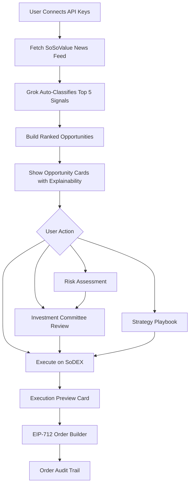

---

## System Architecture

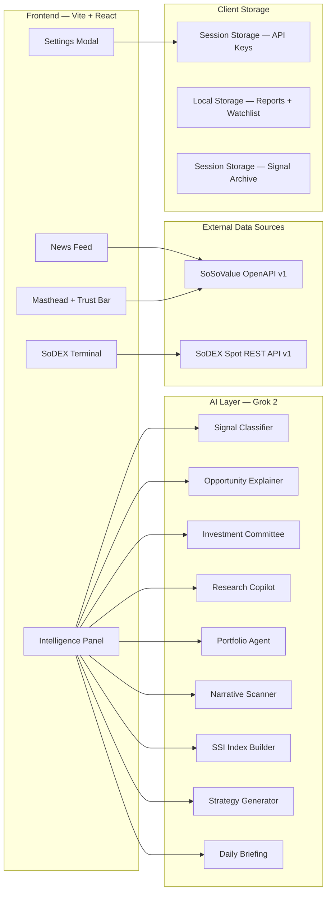

---

## User Flow

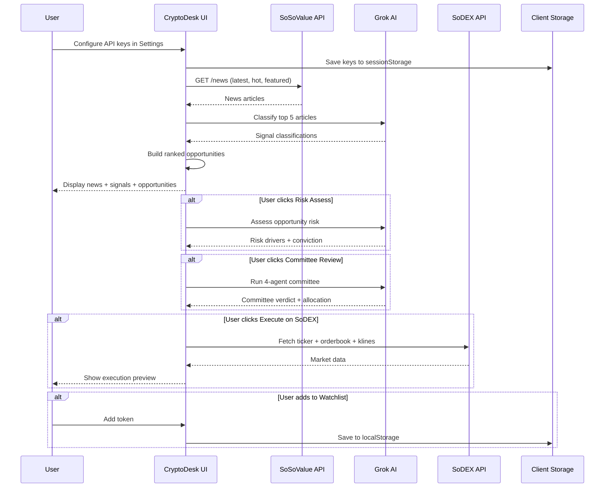

---

## Data Flow

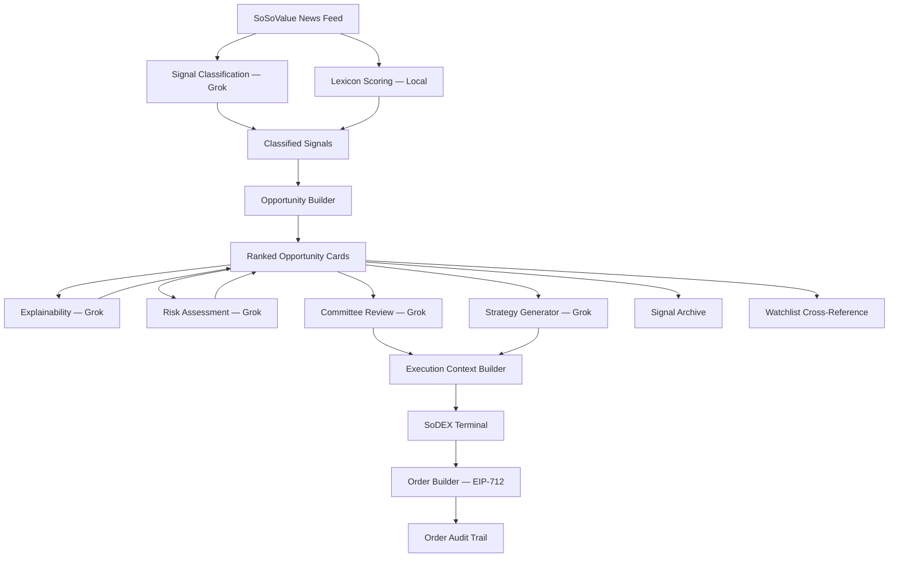

---

## AI Agent Layer

CryptoDesk uses Grok 2 (`grok-2` model via `api.x.ai`) as its AI backbone. All AI calls are client-side — no backend server required.

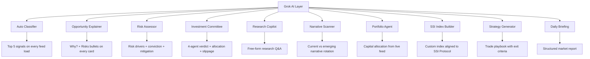

---

### AI Agent Details

| Agent | Trigger | Input | Output |
|---|---|---|---|
| Auto Classifier | Every feed load | Top 5 news articles | Sentiment, confidence, assets, recommendation |
| Opportunity Explainer | Background after classify | All opportunities + news | Why? and Risks bullets on each card |
| Risk Assessor | User clicks "Risk Assess" | Article + recommendation | Risk level, drivers, conviction, mitigation |
| Investment Committee | User clicks "Committee" | Article + opportunity | 4-agent vote, allocation %, slippage |
| Research Copilot | User types query | News feed + question | Structured research answer |
| Narrative Scanner | User opens Narratives | News + sector data + indices | Current/emerging narratives + rotation insight |
| Portfolio Agent | User configures portfolio | News + capital/risk/goal | Allocations with reasoning |
| SSI Index Builder | User selects theme | News + SSI reference data | Themed index with weights + methodology |
| Strategy Generator | User clicks "Strategy" | Article + opportunity | Named playbook with exit criteria |
| Daily Briefing | User clicks "AI Briefing" | Full news feed | Executive summary, signals, risk watch |

---

## SoSoValue Integration

SoSoValue is the primary market data layer. All data is fetched client-side via the SoSoValue OpenAPI v1.

### Endpoints Used

```mermaid
flowchart TD
    A[SoSoValue OpenAPI v1] --> B["GET /news"]
    A --> C["GET /news/hot"]
    A --> D["GET /news/featured"]
    A --> E["GET /currencies"]
    A --> F["GET /currencies/{id}/market-snapshot"]
    A --> G["GET /currencies/{id}/klines"]
    A --> H["GET /currencies/sector-spotlight"]
    A --> I["GET /etfs/summary-history"]
    A --> J["GET /etfs"]
    A --> K["GET /indices"]
    A --> L["GET /indices/{ticker}/constituents"]
    A --> M["GET /indices/{ticker}/market-snapshot"]
    A --> N["GET /btc-treasuries"]
    A --> O["GET /fundraising/projects"]
    A --> P["GET /macro/events"]
    A --> Q["GET /analyses"]

    B --> R[News Feed]
    E --> S[Masthead Tickers]
    H --> T[Sector Spotlight + Narratives]
    I --> U[ETF Flow Monitor]
    K --> V[SSI Index Builder]
    N --> W[BTC Treasuries Panel]
    O --> X[Fundraising Panel]
    P --> Y[Macro Events Panel]
```

### SoSoValue Hub

The SoSoValue Hub tab fires 8 parallel GETs on open:

| Endpoint | Panel |
|---|---|
| `/currencies/sector-spotlight` | Sectors |
| `/etfs/summary-history` | ETF Flows |
| `/indices` | SSI Indices |
| `/btc-treasuries` | BTC Treasuries |
| `/fundraising/projects` | Fundraising |
| `/macro/events` | Macro Calendar |
| `/etfs` | ETF List |
| `/analyses` | On-Chain Analytics |

---

## SoDEX Integration

SoDEX is the market microstructure and execution preview layer. Public market data does not require authentication.

### Endpoints Used

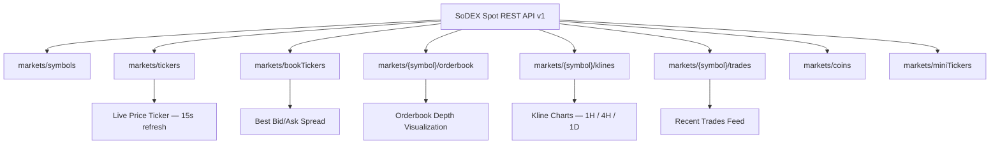

### Execution Flow

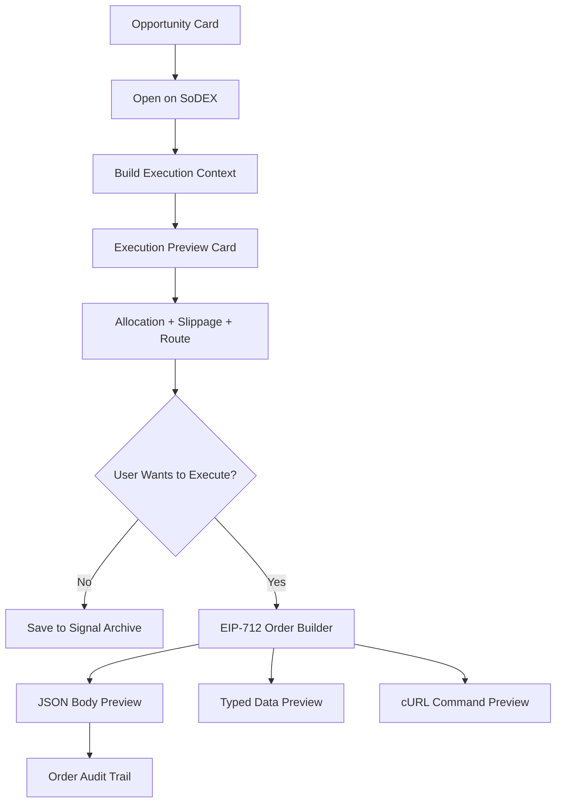

### SoDEX Usage Levels

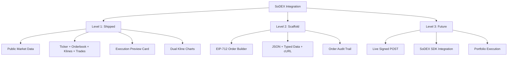

---

## Signal Classification Engine

CryptoDesk uses a hybrid classification approach:

1. **Lexicon scoring** — local keyword-based sentiment analysis runs on every article immediately
2. **Grok classification** — AI-powered deep classification runs on the top 5 articles

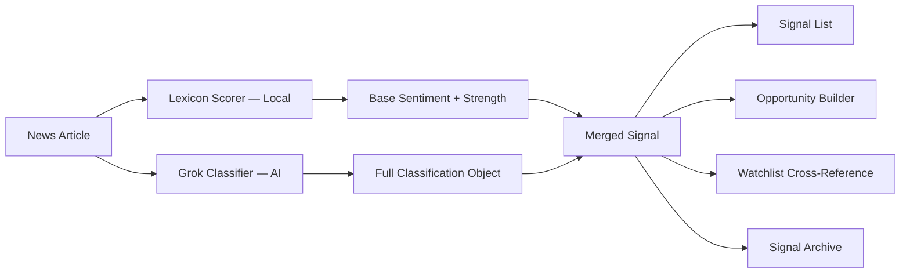

---

## Panels

CryptoDesk has a three-column terminal layout.

```mermaid
flowchart TD
    A[CryptoDesk Terminal] --> B[Left — Navigation]
    A --> C[Center — Main Workspace]
    A --> D[Right — Intelligence Panel]

    B --> E[Category Filters]
    B --> F[SoSoValue Data Sections]
    B --> G[Panel Shortcuts]
    B --> H[Judge Demo Button]

    C --> I[News Feed Tab]
    C --> J[SoSoValue Hub Tab]
    C --> K[SoDEX Terminal Tab]

    D --> L[Signals Panel]
    D --> M[Opportunities Panel]
    D --> N[Article Analysis Panel]
    D --> O[Briefing Panel]
    D --> P[Research Copilot Panel]
    D --> Q[Narratives Panel]
    D --> R[Portfolio Panel]
    D --> S[SSI Index Panel]
    D --> T[Strategy Panel]
    D --> U[Watchlist Panel]
    D --> V[Signal Archive Panel]
    D --> W[Order Audit Panel]
```

### Navigation Panels

| Panel | Shortcut | Purpose |
|---|---|---|
| News Feed | Default | Browse SoSoValue articles |
| SoSoValue Hub | [HUB] | 8 parallel data dashboards |
| SoDEX Terminal | [SDX] | Live market data + order builder |
| Signals | [SIG] | AI-classified signal list |
| Opportunities | [OPP] | Ranked opportunity cards |
| AI Briefing | [BRF] | Grok-generated market briefing |
| Research Copilot | [CP] | Free-form research Q&A |
| Narratives | [NAR] | Narrative rotation scanner |
| Portfolio | [PF] | Portfolio intelligence agent |
| SSI Index | [SSI] | Custom index builder |
| Strategy | [STR] | Trade playbook generator |
| Watchlist | [WCH] | Token watchlist with alerts |
| Signal Archive | [ARC] | Session signal history |
| Order Audit | [AUD] | Prepared order trail |
| Judge Demo | [DEM] | Guided 7-step demo wizard |

---

## Storage

CryptoDesk stores only real user-generated data. All storage is client-side.

### Session Storage

| Key | Data |
|---|---|
| `cd_soso` | SoSoValue API key |
| `cd_grok` | Grok API key |
| `cd_sodex` | SoDEX API key |
| `cd_topic` | Focus topic preference |
| `cd_dark` | Dark mode preference |

### Local Storage

| Key | Data |
|---|---|
| `cd_watchlist` | User-added watchlist tokens |
| `cd_signal_archive` | Persistent signal history |
| `cd_order_audit` | Prepared order audit trail |

### Rules

- No fake reports
- No seeded watchlist data
- No mock dashboard metrics
- No hardcoded market data
- All data comes from live API responses or real user actions

---

## Button Behavior

Every visible button must work.

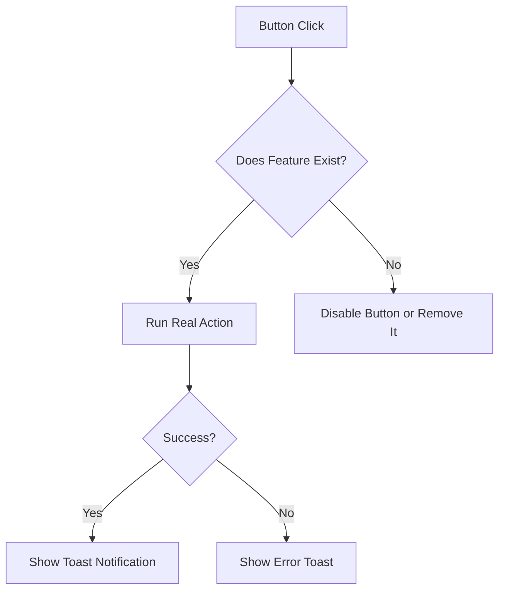

### Key Buttons

| Button | Behavior |
|---|---|
| Connect API | Save keys and reload live data |
| AI Briefing | Generate Grok market briefing |
| Risk Assess | Run AI risk assessment on opportunity |
| Committee | Run 4-agent investment committee |
| Strategy | Generate trade strategy playbook |
| Execute on SoDEX | Open SoDEX terminal with execution context |
| Add to Watchlist | Save token to watchlist |
| Research Copilot | Ask free-form question |
| Narrative Scan | Run narrative rotation detection |
| Build Portfolio | Generate AI portfolio allocation |
| Build SSI Index | Design custom thematic index |
| Prepare Order | Build EIP-712 signed order preview |
| Export JSON | Download signal archive or order audit |
| Judge Demo | Start guided 7-step demo wizard |

---

## Environment Variables

CryptoDesk is a client-side SPA. API keys are entered through the Settings modal and stored in `sessionStorage`. No `.env` file is required for basic operation.

### Required API Keys

| Key | Source | Purpose |
|---|---|---|
| SoSoValue API Key | [SoSoValue OpenAPI](https://openapi.sosovalue.com) | Market data, news, indices, ETFs |
| Grok API Key | [xAI API](https://api.x.ai) | AI classification, agents, research |

### Optional

| Key | Source | Purpose |
|---|---|---|
| SoDEX API Key | [SoDEX](https://sodex.com) | Authenticated execution actions (future) |

### Environment URLs

```text
Testnet Spot:  https://testnet-gw.sodex.dev/api/v1/spot
Testnet Perps: https://testnet-gw.sodex.dev/api/v1/perps

Mainnet Spot:  https://mainnet-gw.sodex.dev/api/v1/spot
Mainnet Perps: https://mainnet-gw.sodex.dev/api/v1/perps
```

---

## Installation

```bash
git clone https://github.com/Nanle-code/CryptoDesk.git
cd CryptoDesk
npm install
```

---

## Running Locally

```bash
npm run dev
```

Open:

```text
http://localhost:5173
```

---

## Build

```bash
npm run build
```

Build output is written to `dist/`.

---

## Preview Production Build

```bash
npm run preview
```

---

## Project Structure

```text
cryptodesk/
├── index.html
├── vite.config.js
├── package.json
├── netlify.toml
├── manifest.json
│
├── src/
│   ├── main.jsx
│   ├── App.jsx
│   │
│   ├── api/
│   │   ├── sosovalue.js          # SoSoValue OpenAPI v1 client
│   │   ├── sodex.js              # SoDEX Spot REST API v1 client
│   │   ├── grok.js               # Grok 2 AI agent layer
│   │   └── claude.js             # Claude API client (optional)
│   │
│   ├── components/
│   │   ├── Masthead.jsx          # Top bar — logo, tickers, AI briefing
│   │   ├── TrustBar.jsx          # Stats bar — articles, signals, sentiment
│   │   ├── Nav.jsx               # Left navigation — categories, panels
│   │   ├── MainWorkspace.jsx     # Center — news feed, SoSo hub, SoDEX
│   │   ├── IntelligencePanel.jsx # Right — all intelligence panels
│   │   ├── NewsFeed.jsx          # News article list
│   │   ├── SignalList.jsx        # AI-classified signal cards
│   │   ├── OpportunityList.jsx   # Ranked opportunity cards
│   │   ├── SoDEXTerminal.jsx     # SoDEX market data terminal
│   │   ├── SoSoDashboard.jsx     # SoSoValue Hub — 8 data panels
│   │   ├── KlineChartPanel.jsx   # Kline chart container
│   │   ├── MiniKlineChart.jsx    # Compact kline chart renderer
│   │   ├── OrderExecutionScaffold.jsx # EIP-712 order builder
│   │   ├── ExecutionPreviewCard.jsx   # Bound execution preview
│   │   ├── WatchlistPanel.jsx    # Token watchlist with alerts
│   │   ├── NarrativePanel.jsx    # Narrative rotation display
│   │   ├── PortfolioPanel.jsx    # Portfolio allocation display
│   │   ├── SSIIndexPanel.jsx     # SSI index builder + live data
│   │   ├── StrategyPanel.jsx     # Strategy playbook display
│   │   ├── ResearchCopilot.jsx   # Free-form research Q&A
│   │   ├── SignalArchivePanel.jsx # Signal history + export
│   │   ├── OrderAuditPanel.jsx   # Order audit trail + export
│   │   ├── SettingsModal.jsx     # API key configuration
│   │   ├── DemoWizard.jsx        # Judge demo — 7-step wizard
│   │   ├── Background.jsx        # Animated background
│   │   ├── Toast.jsx             # Toast notification
│   │   └── VirtualList.js        # Virtualized list renderer
│   │
│   ├── context/
│   │   └── ConfigContext.jsx     # Global config, API keys, toast
│   │
│   ├── hooks/
│   │   ├── useNews.js            # News fetching + signal classification
│   │   └── useTickers.js         # Masthead ticker data
│   │
│   ├── lib/
│   │   ├── signals.js            # Opportunity builder + merge logic
│   │   ├── aiSignals.js          # Grok signal classification
│   │   ├── explainability.js     # Opportunity explainability engine
│   │   ├── executionPreview.js   # Execution context builder
│   │   ├── watchlist.js          # Watchlist logic + alerts + intel
│   │   ├── ssiIndex.js           # SSI reference fetcher + merge
│   │   ├── signalArchive.js      # Signal archive persistence
│   │   ├── sodexExecution.js     # SoDEX order builder + audit
│   │   ├── sodexSymbol.js        # Asset → SoDEX symbol mapper
│   │   ├── klineChart.js         # Kline chart rendering logic
│   │   ├── klineData.js          # Kline data normalization
│   │   ├── currencyLookup.js     # Currency ID resolution
│   │   ├── demoWizard.js         # Demo step definitions
│   │   ├── mockNews.js           # Demo mode fallback data
│   │   ├── parseGrokJson.js      # Safe JSON parser for Grok
│   │   ├── format.js             # Number formatting utilities
│   │   └── api.js                # SoSoValue fetch wrapper
│   │
│   ├── utils/
│   │   ├── format.js             # Display formatting helpers
│   │   └── intelligence.js       # Intelligence computation
│   │
│   ├── core/
│   │   ├── app.js                # Core application logic
│   │   ├── state.js              # State management
│   │   └── motion.js             # Animation engine
│   │
│   └── styles/
│       ├── design-system.css     # Design tokens + CSS variables
│       ├── app.css               # Application layout styles
│       ├── components.css        # Component-level styles
│       └── animations.css        # Micro-animation definitions
│
├── public/
│   └── manifest.json
│
├── docs/
│   ├── ROADMAP.md
│   ├── WAVE2_SUBMISSION.md
│   └── WAVE3_SUBMISSION.md
│
├── dist/                         # Production build output
└── legacy/                       # Previous version files
```

---

## Component Architecture

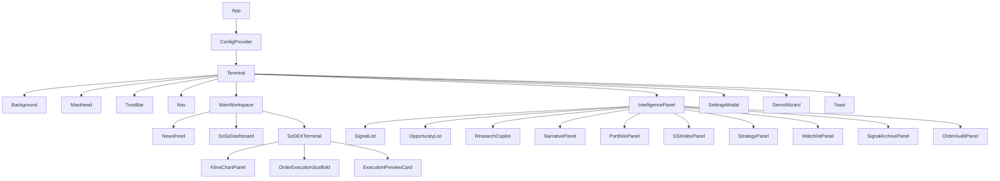

---

## Safety Rules

CryptoDesk follows these rules:

1. No mock market data in production mode.
2. No fake dashboard metrics.
3. No seeded signals or opportunities.
4. No silent API fallback — errors are always surfaced.
5. No wallet required before analysis.
6. No mainnet execution by default — SoDEX testnet only.
7. No auto-execution — all orders require manual preparation.
8. API keys stored in sessionStorage — never persisted to disk.
9. All AI outputs labeled as AI-generated.
10. All user inputs validated before API calls.
11. All errors shown via toast notifications.

---

## Error Handling

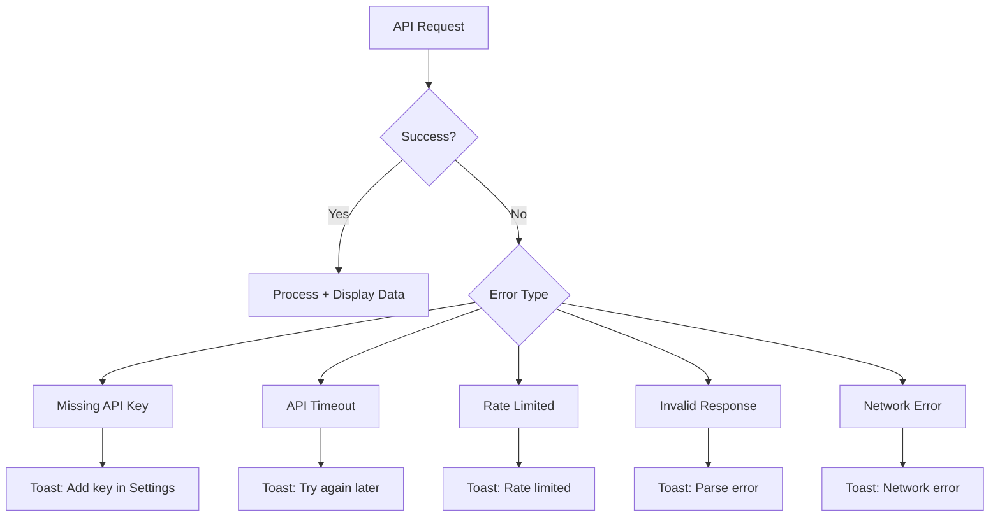

---

## Empty States

| State | Behavior |
|---|---|
| No API keys | Demo mode with sample data; toast prompts to connect |
| No Grok key | AI features disabled; lexicon signals only |
| No signals yet | Loading indicator during Grok classification |
| No watchlist | Empty state with "Add tokens" prompt |
| No archive | Empty state with explanation |
| API failure | Error toast with specific message |

---

## Tech Stack

| Layer | Technology |
|---|---|
| Framework | React 19 |
| Build Tool | Vite 6 |
| AI Model | Grok 2 (xAI) |
| Market Data | SoSoValue OpenAPI v1 |
| Exchange Data | SoDEX Spot REST API v1 |
| Styling | Vanilla CSS + CSS Variables |
| Typography | Inter + JetBrains Mono (Google Fonts) |
| Hosting | Netlify |
| Storage | sessionStorage + localStorage |
| State Management | React hooks + Context API |

---

## Business Model

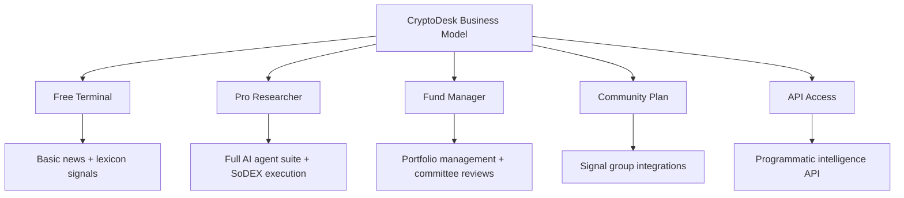

### Pricing Plan Ideas

| Plan | Target User | Example Price |
|---|---|---|
| Free | Beginners | Free |
| Pro Researcher | Active traders | $29/month |
| Fund Manager | Serious portfolio managers | $99/month |
| Community | Signal groups | $399/month |
| API | Bots, wallets, DeFi apps | Usage-based |

---

## Roadmap

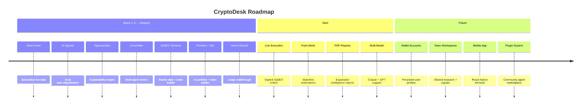

---

## Judge Demo

CryptoDesk includes a built-in 7-step judge demo wizard accessible from the left navigation bar.

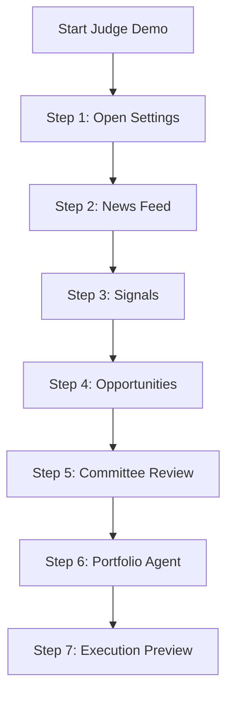

Each step navigates the terminal to the relevant panel and triggers the appropriate action. Toasts confirm progress.

---

## Links

- **Live Demo:** [https://cryptodesk-terminal.netlify.app](https://cryptodesk-terminal.netlify.app)
- **GitHub:** [https://github.com/Nanle-code/CryptoDesk](https://github.com/Nanle-code/CryptoDesk)
- **Strategy Doc:** `nextstep.md` in repo root
- **Roadmap:** `docs/ROADMAP.md`

---

## Quality Checklist

- [x] All panels load correctly
- [x] Navigation links work
- [x] SoSoValue integration connected — news, tickers, sectors, ETFs, indices, treasuries, fundraising, macro
- [x] SoDEX integration connected — tickers, orderbook, klines, trades, bookTickers
- [x] Grok AI classification works on feed load
- [x] Opportunity explainability (Why? / Risks) renders automatically
- [x] Investment committee returns structured multi-agent verdict
- [x] Portfolio agent generates allocations from live feed
- [x] SSI index builder aligns with live SoSoValue indices
- [x] Narrative rotation scanner detects current vs emerging themes
- [x] Strategy generator creates playbooks from opportunities
- [x] Research copilot answers free-form questions
- [x] SoDEX terminal shows execution preview card
- [x] Dual kline charts load on SoDEX tab
- [x] EIP-712 order builder generates JSON + typed data + cURL
- [x] Watchlist alerts fire on high-severity signals
- [x] Signal archive persists across tab lifecycle
- [x] Order audit trail tracks prepared orders
- [x] Export JSON works for archive and audit
- [x] Judge demo wizard navigates all 7 steps
- [x] App is responsive on mobile
- [x] `npm run build` passes
- [x] No mock data in production mode

---

## Disclaimer

CryptoDesk is a market intelligence and research tool.

It does not provide financial advice.

AI-generated signals, opportunities, committee reviews, and portfolio allocations are designed to help users understand market conditions and potential trade ideas. Users remain fully responsible for their own trading decisions.

All SoDEX execution features operate in testnet/preview mode by default. No real trades are executed.

---

## One-Line Summary

**CryptoDesk is an AI-powered on-chain intelligence terminal that connects SoSoValue market data, Grok AI classification, multi-agent investment committee reviews, and SoDEX execution previews into a single data-to-decision workflow — all client-side, no backend required.**